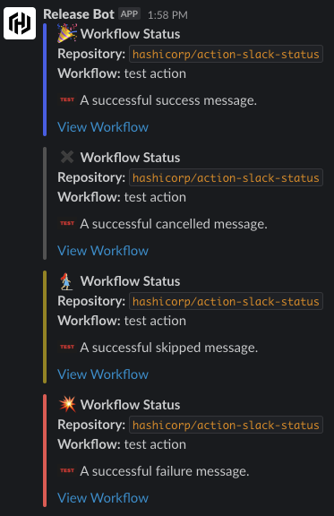

_For internal HashiCorp use only. The output of this action is specifically designed to satisfy the needs of our internal deployment system, and may not be useful to other organizations._

# Slack workflow status action

No bells, no whistles, just status a status message.

## Example

See also some implementations in the wild:
- [hashicorp/vault-helm](https://github.com/hashicorp/vault-helm/blob/bb9a069/.github/workflows/update-helm-charts-index.yml#L34-L40)

Notifications will be emitted with some simple formatting:



## Usage

1. Create a webhook

Use either [Technique 2](https://github.com/slackapi/slack-github-action#technique-2-slack-app) or 
[Technique 3](https://github.com/slackapi/slack-github-action#technique-3-slack-incoming-webhook) here. Alternatively,
Release Engineering may provision one on your behalf for status notifications from our [Release Bot](https://api.slack.com/apps/A034FRWL0RK/incoming-webhooks).

Do *not* use Slack's Workflow Builder integration to generate the webhook link.

2. Add the step to the workflow

To use, add a step that tests the job status (success, failure, cancelled):

```yaml
steps:
  # ...
  - run: |
      echo "This run failed!" 1>&2
      exit 1
  - uses: hashicorp/actions-slack-status@v1
    if: ${{always()}}
    with:
      success-message: "A *bolded success* message."
      failure-message: "A failure message."
      #cancelled-message: "Operation cancelled, but that's okay!"
      status: ${{job.status}}
      slack-webhook-url: ${{secrets.slack_webhook_url}}
```

Or more advanced usage with, pass a specific step conclusion (success, failure, cancelled, skipped):

```yaml
steps:
  # ...
  - if: ${{ 'skip-me' == 'true' }}  # this demo will always skip, use a real test instead :)
    id: demo
    run: |
      exit 0
  - uses: hashicorp/actions-slack-status@v1
    with:
      skipped-message: "A successfully skipped `cmd` message."
      success-message: "A success message."
      status: ${{steps.demo.conclusion}}
      slack-webhook-url: ${{secrets.slack_webhook_url}}
```


Note: Normally, if an `${status}-message` is not defined for a given status a
GH warning will be emitted on the action and no message will be sent to slack.
To avoid this, one can use an approprate `if` statement to skip this step.

In this example, success messages are never sent and no GHA warning will be
emitted regarding this omission.
```yaml
steps:
  - run: |
      exit 0
  - uses: hashicorp/actions-slack-status@v1
    if: failure()
    with:
      failure-message: "Since our job never fails, this message will never send nor will it warn about a missing success-message field"
      status: 'failure'
      slack-webhook-url: ${{secrets.slack_webhook_url}}
```

### Job Status Meanings

In the examples we used different ways of obtaining the statuses. Their usage can be nuanced, but generally they are:

[jobs.status docs](https://docs.github.com/en/actions/learn-github-actions/contexts#job-context): success, failure or cancelled
[steps.id.conclusion docs](https://docs.github.com/en/actions/learn-github-actions/contexts#steps-context): success, failure, cancelled, or skipped
[steps.id.outcome docs](https://docs.github.com/en/actions/learn-github-actions/contexts#steps-context): success, failure, cancelled, or skipped

If in doubt, use `${{jobs.status}}`. The specific step status can be useful if we need to report skips or when multiple
steps are mutually exclusive and we would like to notify exactly which one fired.

Step conclusion and outcome can differ depending on whether `continue-on-error` is set. In otherwords, if
a step's `continue-on-error: true`, the outcome may be `failure` or `success` but the conclusion would be `success`.
